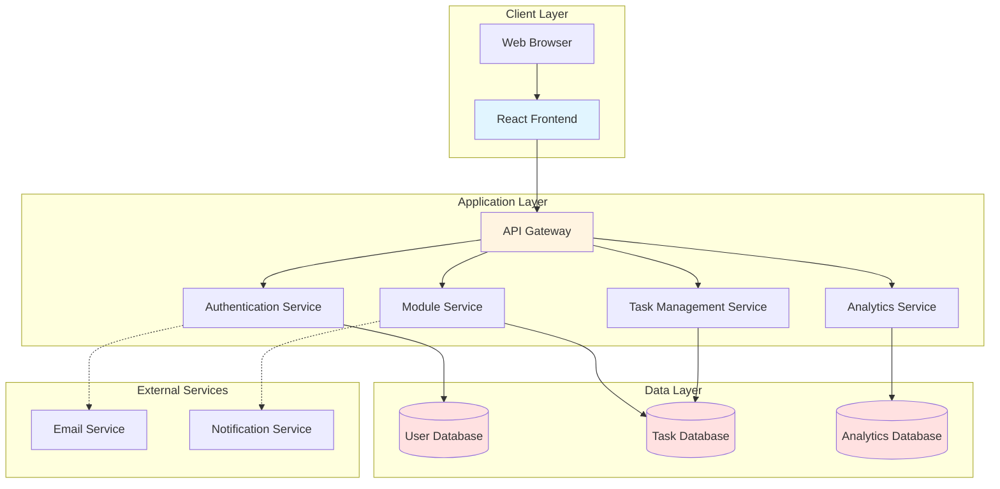
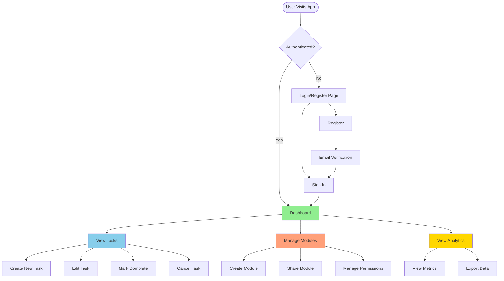
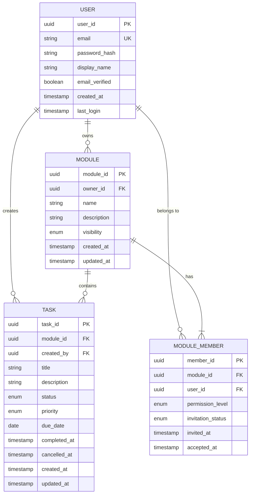

# Business Requirements Document
## To-Do Application with Module Sharing and Analytics

**Document Version:** 1.1  
**Date:** April 30, 2026  
**Prepared By:** Senior Business Analyst

---

## 1. Executive Summary

This document outlines the business requirements for a collaborative to-do application that enables users to manage tasks, organize them into modules (groups), share these modules with other users, and gain insights through an analytical dashboard.

### 1.1 Purpose
To develop a simple yet powerful task management system that facilitates individual productivity and team collaboration through shared task modules with comprehensive analytics.

### 1.2 Business Objectives
- Enable users to efficiently manage personal and shared tasks
- Facilitate collaboration through module-based task sharing
- Provide actionable insights through data-driven analytics
- Create a scalable foundation for future enhancements

---

## 2. Scope

### 2.1 In Scope
- User registration and authentication system (web application only)
- Task creation, management, and status tracking
- Module-based task organization
- Module sharing capabilities between users
- Analytics dashboard with key performance metrics
- Notification system including task reminders

### 2.2 Out of Scope (Future Enhancements)
- Mobile native applications
- Real-time collaborative editing
- Integration with third-party calendars
- File attachments to tasks

---

## 3. Stakeholders

| Stakeholder | Role | Interest |
|------------|------|----------|
| End Users | Primary Users | Task management and collaboration |
| Product Manager | Owner | Product success and user adoption |
| Development Team | Builders | Technical implementation |
| Business Analysts | Requirements | Requirement clarity and validation |
| QA Team | Quality Assurance | System reliability and usability |

---

## 4. Functional Requirements

### 4.1 User Management

#### 4.1.1 User Registration
**Requirement ID:** FR-UM-001  
**Priority:** High  
**Description:** Users must be able to create an account to access the application.

**Acceptance Criteria:**
- User provides email, password, and display name
- Email validation to ensure valid format
- Password strength requirements (minimum 8 characters, mix of letters and numbers)
- Email verification through confirmation link
- Duplicate email prevention
- Success/error messaging

**Business Rules:**
- Each email can only be registered once
- Passwords must be encrypted and stored securely
- User account is inactive until email is verified

#### 4.1.2 User Login
**Requirement ID:** FR-UM-002  
**Priority:** High  
**Description:** Registered users must be able to authenticate and access their account.

**Acceptance Criteria:**
- Login using email and password
- Session management with configurable timeout
- "Remember Me" functionality for extended sessions
- Password reset via email link
- Account lockout after 5 failed login attempts
- Clear error messaging for invalid credentials

**Business Rules:**
- Only verified users can log in
- Sessions expire after 30 minutes of inactivity
- Locked accounts unlock after 30 minutes or via email verification

---

### 4.2 Task Management

#### 4.2.1 Create To-Do Items
**Requirement ID:** FR-TM-001  
**Priority:** High  
**Description:** Users can create individual to-do items with relevant details.

**Acceptance Criteria:**
- Create task with title (required), description (optional), due date (optional), priority level
- Assign task to a module
- Set priority (High, Medium, Low)
- Add tags for categorization
- Task automatically assigned to creator
- Default status: "Pending"

**Business Rules:**
- Title is mandatory (max 200 characters)
- Description is optional (max 2000 characters)
- Due date cannot be in the past
- Each task must belong to exactly one module

#### 4.2.2 Mark Task as Completed
**Requirement ID:** FR-TM-002  
**Priority:** High  
**Description:** Users can mark tasks as completed when finished.

**Acceptance Criteria:**
- Single-click action to mark as completed
- Completed timestamp is recorded
- Completed tasks visually distinguished (strikethrough, different color)
- Ability to undo completion within same session
- Completion status reflected in analytics

**Business Rules:**
- Only task creator or module members can mark tasks complete
- Completed date is automatically set to current timestamp
- Completed tasks remain visible in module

#### 4.2.3 Cancel Task
**Requirement ID:** FR-TM-003  
**Priority:** Medium  
**Description:** Users can cancel tasks that are no longer relevant.

**Acceptance Criteria:**
- Option to cancel task with optional reason
- Cancelled timestamp is recorded
- Cancelled tasks visually distinguished (grayed out)
- Cancelled tasks can be filtered from view
- Cancellation status reflected in analytics

**Business Rules:**
- Only task creator or module owner can cancel tasks
- Cancelled tasks are soft-deleted (retained in database)
- Cancelled tasks don't count toward completion metrics

---

### 4.3 Module Management

#### 4.3.1 Create Modules
**Requirement ID:** FR-MM-001  
**Priority:** High  
**Description:** Users can create modules to organize related tasks.

**Acceptance Criteria:**
- Create module with name and description
- Set module visibility (Private/Shared)
- Creator becomes module owner
- Default module created for new users ("Personal Tasks")

**Business Rules:**
- Module name is mandatory (max 100 characters)
- Users can create an unlimited number of modules
- Module names must be unique per user

#### 4.3.2 Share Modules
**Requirement ID:** FR-MM-002  
**Priority:** High  
**Description:** Module owners can share modules with other registered users.

**Acceptance Criteria:**
- Share module via user email
- Set permission levels (View, Edit, Admin)
- Send notification to invited users
- Accept/reject sharing invitation
- View list of shared users per module
- Revoke sharing access

**Permission Levels:**
- **View:** Can see tasks, cannot modify
- **Edit:** Can create, modify, complete, and cancel tasks
- **Admin:** Edit permissions plus ability to share with others and delete module

**Business Rules:**
- Only module owner can share the module initially
- Admins can share but cannot remove the owner
- User must accept invitation before accessing shared module
- Module owner cannot be removed
- Sharing is limited to verified users only

---

### 4.3.3 Task Reminder Notifications
**Requirement ID:** FR-MM-003  
**Priority:** High  
**Description:** The system must send reminder notifications to users about upcoming and overdue tasks to help them stay on track.

**Acceptance Criteria:**
- Users can enable or disable task reminders per task when setting or editing a due date
- Reminder notification options: 15 minutes, 1 hour, 1 day, or 2 days before the due date
- Overdue tasks trigger a reminder notification when the due date/time passes and the task is still pending
- Notifications are displayed in-app via a notification bell/inbox icon in the header
- Unread notification count badge shown on the bell icon
- Each notification links directly to the relevant task
- Users can mark individual notifications as read or clear all notifications
- Users can manage notification preferences in account settings (enable/disable reminder types)

**Business Rules:**
- Reminder notifications are only sent for tasks with a due date set
- Reminders are sent to the task creator and any module members with Edit or Admin permission
- Overdue notifications are sent once when a task becomes overdue; no repeated overdue alerts
- Notifications are stored in-app and displayed in the notification centre; no email delivery required for reminders
- Dismissed or read notifications are retained for 30 days before automatic deletion

---

### 4.4 Analytics Dashboard

#### 4.4.1 Dashboard Overview
**Requirement ID:** FR-AD-001  
**Priority:** High  
**Description:** Users have access to a personal analytics dashboard showing task and productivity metrics.

**Acceptance Criteria:**
- Display key metrics in card/widget format
- Visualizations using charts and graphs
- Date range selector for historical analysis
- Export dashboard data as PDF/CSV
- Responsive layout for different screen sizes

**Required Metrics:**

1. **Task Completion Rate**
   - Percentage of completed tasks vs. total tasks
   - Trend over time (daily/weekly/monthly)

2. **Task Status Distribution**
   - Pie/donut chart showing Pending, Completed, Cancelled
   - Count and percentage for each status

3. **Module Performance**
   - Completion rate per module
   - Bar chart comparing modules
   - Most active modules

4. **Priority Analysis**
   - Distribution of tasks by priority level
   - Completion rate by priority
   - Overdue high-priority tasks

5. **Time-based Analytics**
   - Tasks created vs. completed over time (line chart)
   - Average time to completion
   - Overdue tasks trend

6. **Productivity Insights**
   - Most productive day of week
   - Peak completion hours
   - Completion velocity (tasks per week)

7. **Sharing Metrics**
   - Number of shared modules
   - Collaboration activity
   - Most active collaborators

**Business Rules:**
- Dashboard shows data for last 30 days by default
- Users can filter by date range (last 7, 30, 90 days, or custom)
- Shared module data only includes tasks user has permission to view
- Real-time data refresh every 5 minutes

---

## 5. System Architecture

### 5.1 High-Level Architecture



### 5.2 User Flow Diagram



---

## 6. Data Model Concepts

### 6.1 Entity Relationship Overview



### 6.2 Key Enumerations

**Task Status:**
- PENDING
- COMPLETED
- CANCELLED

**Task Priority:**
- HIGH
- MEDIUM
- LOW

**Module Visibility:**
- PRIVATE
- SHARED

**Permission Level:**
- VIEW
- EDIT
- ADMIN

**Invitation Status:**
- PENDING
- ACCEPTED
- REJECTED

---

## 7. User Stories

### Epic 1: User Authentication
- **US-001:** As a new user, I want to register for an account so that I can start managing my tasks.
- **US-002:** As a registered user, I want to log in securely so that I can access my tasks.
- **US-003:** As a user who forgot my password, I want to reset it via email so that I can regain access.

### Epic 2: Task Management
- **US-004:** As a user, I want to create tasks with titles and descriptions so that I can track my work.
- **US-005:** As a user, I want to mark tasks as completed so that I can see my progress.
- **US-006:** As a user, I want to cancel tasks that are no longer relevant so that my list stays clean.
- **US-007:** As a user, I want to set due dates and priorities so that I can focus on important tasks.
- **US-008:** As a user, I want to receive reminder notifications before a task is due so that I never miss a deadline.

### Epic 3: Module Organization
- **US-009:** As a user, I want to create modules to organize related tasks so that I can manage different projects.
- **US-010:** As a user, I want to share modules with colleagues so that we can collaborate on tasks.
- **US-011:** As a module owner, I want to control who can view and edit my modules so that I maintain appropriate access.

### Epic 4: Analytics and Insights
- **US-012:** As a user, I want to see my task completion rate so that I can measure my productivity.
- **US-013:** As a user, I want to view trends over time so that I can identify patterns in my work.
- **US-014:** As a team member, I want to see shared module statistics so that I can track team progress.

---

## 8. Non-Functional Requirements

### 8.1 Performance
- **NFR-001:** Page load time must be under 2 seconds on standard broadband
- **NFR-002:** Dashboard analytics must render within 3 seconds
- **NFR-003:** System must support 1,000 concurrent users
- **NFR-004:** API response time must be under 500ms for 95% of requests

### 8.2 Security
- **NFR-005:** All passwords must be hashed using industry-standard algorithms (bcrypt)
- **NFR-006:** All data transmission must use HTTPS/TLS
- **NFR-007:** Authentication tokens must expire after 30 minutes of inactivity
- **NFR-008:** System must implement OWASP Top 10 security measures

### 8.3 Usability
- **NFR-009:** Application must be a web application accessible on modern desktop and tablet browsers; no native mobile app is required in this phase
- **NFR-010:** User interface must follow WCAG 2.1 Level AA accessibility standards
- **NFR-011:** User must be able to complete primary tasks (create task, share module) in under 3 clicks

### 8.4 Reliability
- **NFR-012:** System uptime must be 99.5% or higher
- **NFR-013:** Data backup must occur daily
- **NFR-014:** System must gracefully handle errors with user-friendly messages

### 8.5 Scalability
- **NFR-015:** Architecture must support horizontal scaling
- **NFR-016:** Database must handle up to 10 million tasks
- **NFR-017:** System must support addition of new features without major refactoring

---

## 9. Analytics Dashboard Wireframe Concept

```mermaid
graph TB
    subgraph Dashboard Layout
        A[Header: User Profile & Notifications]
        B[Date Range Selector: Last 7/30/90 Days]
        
        subgraph Row1[Top Metrics Row]
            C1[Total Tasks<br/>Card]
            C2[Completion Rate<br/>Card]
            C3[Overdue Tasks<br/>Card]
            C4[Active Modules<br/>Card]
        end
        
        subgraph Row2[Charts Row 1]
            D1[Task Status<br/>Distribution<br/>Pie Chart]
            D2[Completion Trend<br/>Line Chart]
        end
        
        subgraph Row3[Charts Row 2]
            E1[Module Performance<br/>Bar Chart]
            E2[Priority Analysis<br/>Stacked Bar]
        end
        
        subgraph Row4[Insights Row]
            F1[Productivity Insights<br/>Table/List]
            F2[Sharing Activity<br/>List]
        end
        
        G[Export Options: PDF | CSV]
    end
    
    A --> B
    B --> Row1
    Row1 --> Row2
    Row2 --> Row3
    Row3 --> Row4
    Row4 --> G
    
    style A fill:#4A90E2
    style B fill:#F5A623
    style C1 fill:#7ED321
    style C2 fill:#7ED321
    style C3 fill:#D0021B
    style C4 fill:#7ED321
```

---

## 10. Success Metrics (KPIs)

### 10.1 User Adoption
- User registration growth rate: Target 20% month-over-month
- Active users (daily/monthly): Target 60% DAU/MAU ratio
- User retention rate: Target 70% after 30 days

### 10.2 Engagement
- Average tasks created per user per week: Target 10+
- Module sharing rate: Target 30% of users share at least one module
- Dashboard visit frequency: Target 3 times per week per user

### 10.3 System Performance
- Task completion rate: Target 75% overall
- Average time to complete task: Track and optimize
- System uptime: Target 99.5%

---

## 11. Assumptions and Constraints

### 11.1 Assumptions
- Users have reliable internet connectivity
- Users access the application via modern web browsers (Chrome, Firefox, Safari, Edge — latest 2 versions)
- Email service is available for account-related notifications
- Users understand basic task management concepts

### 11.2 Constraints
- This is a web application; no native mobile apps in this phase
- Single language support (English) in Phase 1
- No limit on modules per user
- Maximum 1000 tasks per module
- File attachments not supported in Phase 1

---

## 12. Risks and Mitigation

| Risk | Impact | Probability | Mitigation Strategy |
|------|--------|-------------|---------------------|
| Low user adoption | High | Medium | Conduct user research, MVP testing, marketing campaign |
| Security breach | High | Low | Regular security audits, penetration testing, bug bounty program |
| Performance issues at scale | Medium | Medium | Load testing, scalable architecture, caching strategy |
| Complex sharing permissions | Medium | High | Clear UI/UX, comprehensive testing, user tutorials |
| Data loss | High | Low | Regular backups, redundancy, disaster recovery plan |

---

## 13. Acceptance Criteria Summary

The application will be considered ready for release when:

1. All High-priority functional requirements are implemented and tested
2. User can complete full workflow: Register → Create Module → Create Task → Share Module → View Analytics
3. All security requirements are validated
4. Performance benchmarks are met (page load < 2s, API < 500ms)
5. User acceptance testing completed with 90%+ satisfaction
6. Zero critical bugs, < 5 high-priority bugs
7. Documentation completed (user guide, API docs, admin guide)

---

## 14. Glossary

| Term | Definition |
|------|------------|
| Module | A collection of related tasks, similar to a project or category |
| To-Do/Task | An individual work item that needs to be completed |
| Module Owner | The user who created the module and has full control |
| Completion Rate | Percentage of completed tasks out of total tasks |
| Soft Delete | Marking data as deleted without removing from database |
| Session | Period of authenticated user activity |

---

## 15. Appendices

### Appendix A: Future Enhancements (Post-MVP)
- Native mobile applications (iOS/Android)
- Real-time collaborative editing
- File attachments
- Calendar integration (Google Calendar, Outlook)
- Recurring tasks
- Task dependencies
- Comments and discussion threads
- Activity timeline/audit log
- Custom fields and templates
- API for third-party integrations
- Multi-language support
- Dark mode theme

### Appendix B: API Endpoints Overview

**Authentication:**
- POST /api/auth/register
- POST /api/auth/login
- POST /api/auth/logout
- POST /api/auth/reset-password

**Tasks:**
- GET /api/tasks
- POST /api/tasks
- PUT /api/tasks/:id
- DELETE /api/tasks/:id
- PATCH /api/tasks/:id/complete
- PATCH /api/tasks/:id/cancel

**Modules:**
- GET /api/modules
- POST /api/modules
- PUT /api/modules/:id
- DELETE /api/modules/:id
- POST /api/modules/:id/share
- DELETE /api/modules/:id/members/:userId

**Notifications:**
- GET /api/notifications
- PATCH /api/notifications/:id/read
- DELETE /api/notifications
- GET /api/notifications/preferences
- PUT /api/notifications/preferences

**Analytics:**
- GET /api/analytics/dashboard
- GET /api/analytics/tasks/completion-rate
- GET /api/analytics/modules/performance
- GET /api/analytics/export

---

**Document Control:**
- **Version:** 1.1
- **Last Updated:** April 30, 2026
- **Next Review:** May 30, 2026
- **Approvers:** Product Manager, Development Lead, Business Analyst
